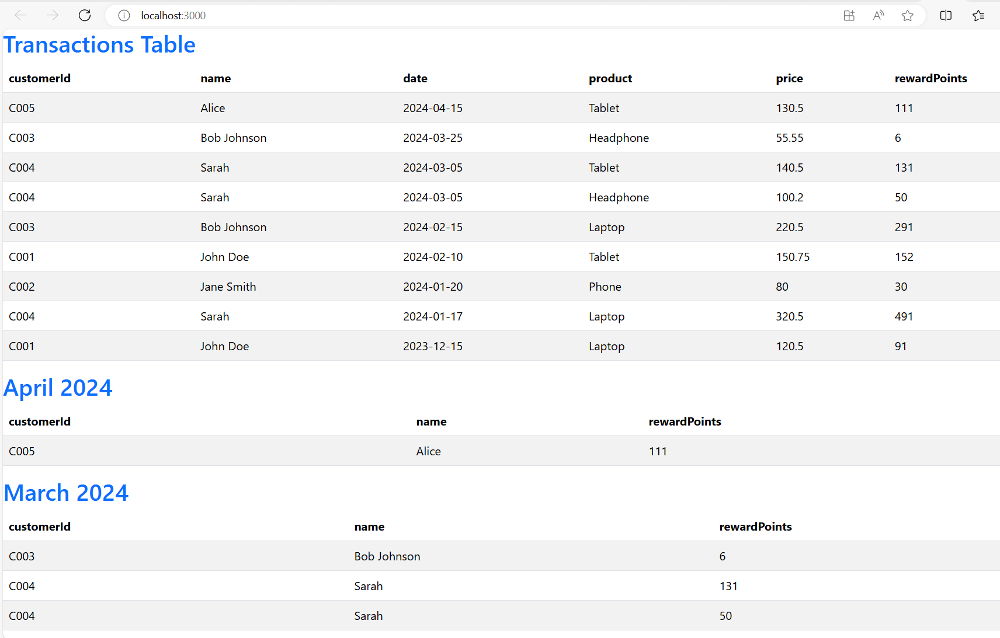
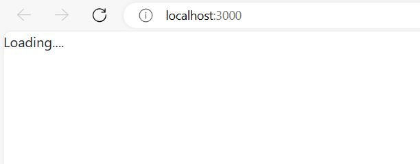
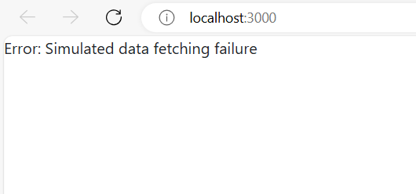
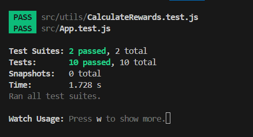

#Rewards Program UI

This project is a React-based UI for a retailer's rewards program. It calculates and displays customer reward points based on their transactions over a three-month period.

##Features
- Calculate reward points based on purchase amounts.
- Display customer rewards in tables.
- Handle large datasets, edge cases, and non-integer values.
- Fully tested with Jest.

## Folder Structure
- `/components`: Reusable UI components.
- `/services`: Contains the API service for data fetching.
- `/utils`: Contains utility functions like CalculateRewards.
- `/modules`: Main modules of the application.
- `/data`: Holds sample transaction data (`data.json`).

## Setup

1. *Clone the repository:*
    bash
    git clone <repo-url>
    cd project-directory
    

2. *Install dependencies:*
    bash
    npm install
    

3. *Run the application:*
    bash
    npm start
    

4. *Run tests:*
    bash
    npm test

## Temporary Changes for Testing

### Disabling ESLint Rule for Console Statements

For testing purposes, we temporarily disabled the no-console ESLint rule. This allows the use of console.log for debugging.

#### How It Was Done:
- **Globally in .eslintrc.json:**
    json
    "rules": {
        "no-console": "off",  // Disable the no-console rule globally
        "no-unused-vars": "warn",
        "semi": ["error", "always"]
    }
    
- *Or Inline in Specific Files:*
    - For specific lines:
      javascript
      // eslint-disable-next-line no-console
      console.log('This line will not trigger an ESLint error');
      
    - For entire files:
      javascript
      /* eslint-disable no-console */
      console.log('Console is allowed in this entire file');
      /* eslint-enable no-console */


### Reverting the Changes
After testing is complete, remember to re-enable the no-console rule to maintain code quality and avoid console logs in production.

- *To revert:*
  ```json
  "rules": {
      "no-console": "error",  // Re-enable the no-console rule
      "no-unused-vars": "warn",
      "semi": ["error", "always"]
  }

## Running Application

Here is a screenshot of the running application:



## Loading State

The application shows a loading indicator while fetching data:



## Error State

If an error occurs during data fetching, the application displays an error message:



## Test Cases Passed

All test cases pass successfully, ensuring the app's functionality:

